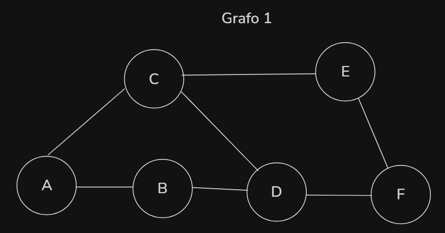
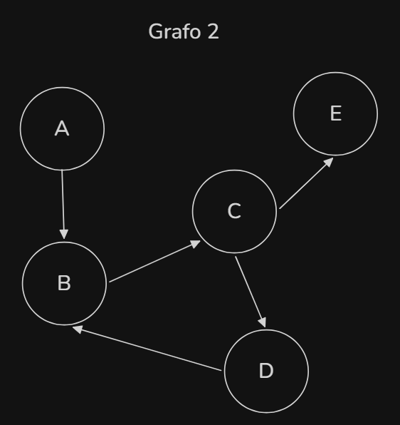
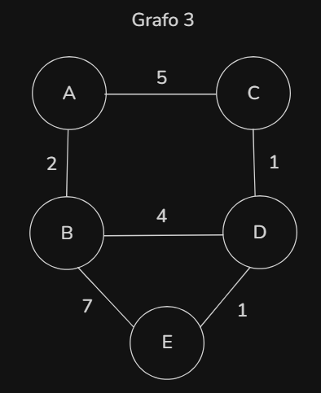

# Exercícios de Grafos com BFS, DFS e UCS

Este projeto resolve três exercícios clássicos de teoria dos grafos usando Python:
- busca em largura (BFS)
- busca em profundidade (DFS)
- busca de custo uniforme (UCS)

A organização dos arquivos ficou assim:
- `graphs.py`: define os grafos usados nos exercícios
- `bfs.py`: implementa a busca em largura
- `dfs.py`: implementa a busca em profundidade com detecção de ciclo
- `ucs.py`: implementa a busca de custo uniforme
- `main.py`: executa os três exercícios e imprime os resultados

## Questão 1 - Busca em largura (BFS)

### Enunciado

Considere o grafo não ponderado abaixo, com arestas não direcionadas:

`A-B, A-C, B-D, C-D, C-E, D-F, E-F`

### Representação visual do Grafo 1



### Como a BFS funciona neste exercício

A BFS visita os vértices por níveis. Isso significa que ela explora primeiro todos os vértices a 1 aresta de distância do ponto inicial, depois os vértices a 2 arestas, e assim por diante.

Começando em `A`:

1. Visitamos `A`
2. Descobrimos seus vizinhos: `B` e `C`
3. Depois exploramos `B`, descobrindo `D`
4. Depois exploramos `C`, descobrindo `E`
5. Depois exploramos `D`, descobrindo `F`

Como a BFS encontra o destino `F` pelo menor número de arestas, o caminho mínimo encontrado foi:

`A -> B -> D -> F`

### Resposta da questão 1

#### (a) Caminho com menor número de arestas de A até F

`A -> B -> D -> F`

#### (b) Ordem de visita dos vértices

`A, B, C, D, E, F`

## Questão 2 - Busca em profundidade (DFS)

### Enunciado

Considere o grafo direcionado com arestas:

`A -> B, B -> C, C -> D, D -> B, C -> E`

### Representação visual do Grafo 2



### Como a DFS funciona neste exercício

A DFS tenta seguir o mais fundo possível em cada caminho antes de voltar.

Começando em `A`:

1. Visitamos `A`
2. Seguimos para `B`
3. De `B`, seguimos para `C`
4. De `C`, seguimos para `D`
5. Em `D`, existe uma aresta voltando para `B`

Como `B` ainda faz parte do caminho ativo da recursão, isso indica a existência de um ciclo.

O ciclo encontrado é:

`B -> C -> D -> B`

### Resposta da questão 2

#### (a) Ordem de exploração a partir de A

`A, B, C, D`

#### (b) Há ciclo no grafo?

Sim. O ciclo é:

`B -> C -> D -> B`

## Questão 3 - Busca de custo uniforme (UCS)

### Enunciado

Considere o grafo ponderado com arestas não direcionadas:

`A-B (2), A-C (5), B-D (4), C-D (1), B-E (7), D-E (1)`

### Representação visual do Grafo 3



### Como a UCS funciona neste exercício

A UCS expande sempre o vértice com menor custo acumulado a partir da origem, usando uma fila de prioridade. Diferente da BFS, ela leva em conta os pesos das arestas — por isso garante o caminho de menor custo total, não o de menor número de arestas.

Começando em `A`:

1. Expandimos `A` (custo 0). Inserimos na fila: `B(2)`, `C(5)`
2. Expandimos `B` (custo 2, o menor). Inserimos: `D(6)`, `E(9)`
3. Expandimos `C` (custo 5). Geraria `D` com custo 6, igual ao já existente — sem alteração
4. Expandimos `D` (custo 6). Descobrimos `E` com custo 7, menor que o `E(9)` atual — **atualizamos**
5. Expandimos `E` (custo 7) — destino alcançado

O caminho de menor custo encontrado foi:

`A -> B -> D -> E` com custo total `7`

### Resposta da questão 3

#### Caminho de menor custo de A até E

`A -> B -> D -> E`

#### Custo total

`7`

#### Ordem de expansão dos vértices

`A, B, C, D, E`

## Relação com o código

Os grafos usados no código estão definidos em `graphs.py`.

- `GRAPH_BFS` representa o Grafo 1
- `GRAPH_DFS` representa o Grafo 2
- `GRAPH_UCS` representa o Grafo 3, com estrutura `{vertice: [(vizinho, peso), ...]}` para suportar os pesos das arestas

A implementação da BFS está em `bfs.py`, a implementação da DFS com detecção de ciclo está em `dfs.py`, e a implementação da UCS com fila de prioridade está em `ucs.py`.

## Como executar

Para executar tudo de uma vez:

```bash
python main.py
```

Se o comando `python` não estiver configurado no ambiente, pode ser necessário instalar o Python ou ajustar o PATH.
